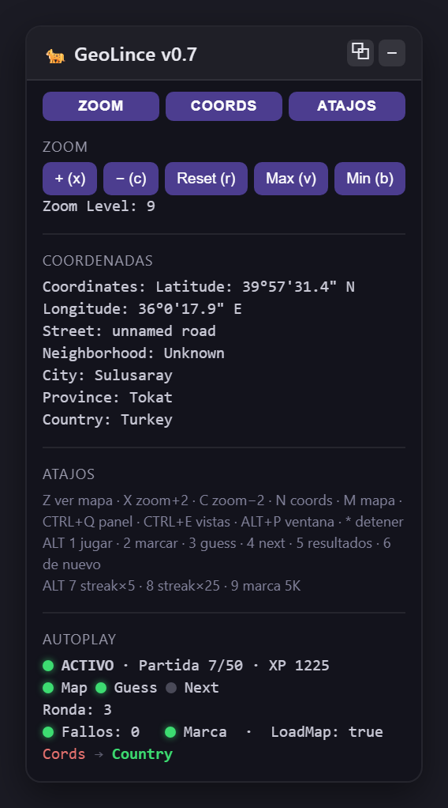
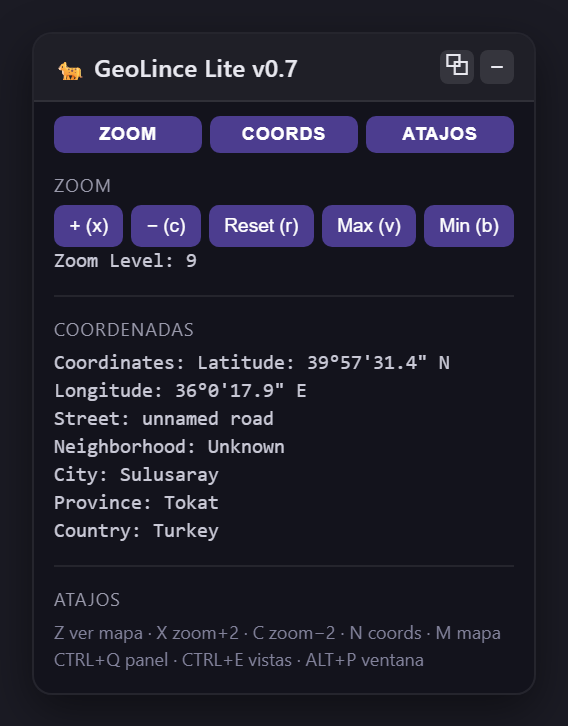
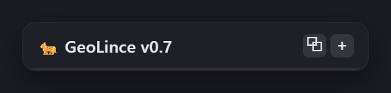
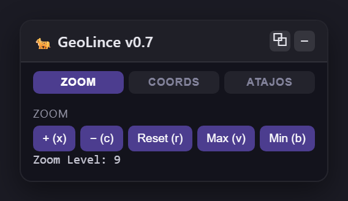
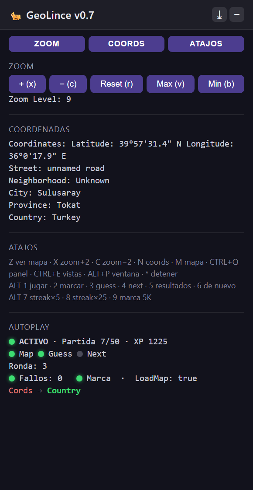

# GeoLince

Userscript (Tampermonkey) para GeoGuessr que muestra en pantalla las coordenadas reales
de la ronda, las abre en un mapa aparte y — en la versión completa — automatiza el juego
en modo Streaks.

Vienen **dos versiones**, y se instala **una sola**:

| | Para qué | Instalá esto |
|---|---|---|
| **Lite** | Jugar vos, en partidas simples o multiplayer, viendo en vivo coordenadas, calle, ciudad, provincia y país, con el mapa en otra ventana. No toca el DOM de GeoGuessr ni hace clicks. | [`geolince-lite.user.js`](geolince-lite.user.js) |
| **Completa** | Todo lo anterior **más** el AutoPlay: marca, adivina, pasa de ronda y arranca partida nueva en modo Streaks. | [`geolince.user.js`](geolince.user.js) |

Las dos son la versión 0.7, corren en `https://www.geoguessr.com/*` y no tienen
dependencias (solo la API de geocoding de OpenCage).

Si dudas, empezá por la **Lite**: es la mitad de código, no depende de los selectores de
GeoGuessr (que cambian en cada deploy del sitio) y hace todo lo que sirve para jugar vos.

> **Aviso**
> Esto es una herramienta de cheat. Usarla en partidas públicas o competitivas va contra
> los términos de servicio de GeoGuessr y puede terminar en la suspensión de la cuenta.
> Úsala bajo tu responsabilidad, idealmente en partidas privadas o para experimentar.

---

## Índice

- [Qué hace](#qué-hace)
- [Instalación](#instalación)
- [Configuración](#configuración)
- [El panel](#el-panel)
- [Atajos de teclado](#atajos-de-teclado)
- [AutoPlay (Streaks)](#autoplay-streaks)
- [Cómo funciona por dentro](#cómo-funciona-por-dentro)
- [Datos guardados (localStorage)](#datos-guardados-localstorage)
- [Problemas frecuentes](#problemas-frecuentes)
- [Estructura del repo](#estructura-del-repo)
- [Historial de versiones](#historial-de-versiones)
- [Licencia](#licencia)

---

## Qué hace

| Función | Detalle |
|---|---|
| **Coordenadas reales** | Intercepta el tráfico de Street View de la página y saca la latitud/longitud exacta del panorama actual. No hace falta apretar nada: se actualizan solas al cambiar de ronda. |
| **Información del lugar** | Geocoding inverso con [OpenCage](https://opencagedata.com/): calle, barrio, ciudad, provincia y país. |
| **Mapa en ventana aparte** | Abre la posición en Google Maps o OpenStreetMap en una ventana separada, con control de zoom. Ideal para un segundo monitor. |
| **Marcador automático** *(solo completa)* | Coloca el pin en el mapa de guess de GeoGuessr en las coordenadas reales (con desvío configurable), hablándole directamente al mapa vía React Fiber. |
| **AutoPlay (Streaks)** *(solo completa)* | Juega solo: marca, adivina, pasa de ronda y arranca partida nueva, con una cadena de reintentos cuando no logra detectar coordenadas. |
| **Panel plegable** | Tres bloques que se muestran/ocultan por separado, y opción de sacar todo el panel a su propia ventana. |

---

## Instalación

1. Instalá [Tampermonkey](https://www.tampermonkey.net/) en Chrome, Edge, Firefox o Brave.
2. Abrí el panel de Tampermonkey → **Crear un script nuevo…**
3. Borrá el contenido del editor y pegá todo
   [`geolince-lite.user.js`](geolince-lite.user.js) **o** [`geolince.user.js`](geolince.user.js),
   según la versión que quieras (ver la tabla de arriba).
4. Guardá (`Ctrl + S`).
5. Entrá a `https://www.geoguessr.com/` y apretá **`Ctrl + Q`** para mostrar el panel.

No instales las dos a la vez: se pisan entre ellas (los dos paneles y los dos juegos de
atajos corren sobre la misma página).

La cabecera del script ya trae lo necesario, no hay que tocarla:

```js
// @match        https://www.geoguessr.com/*
// @grant        none
```

El panel arranca oculto: si no ves nada después de instalarlo, es normal — apretá `Ctrl + Q`.

---

## Configuración

### API key de OpenCage (obligatorio)

El geocoding (calle / barrio / ciudad / provincia / país) usa
[OpenCage](https://opencagedata.com/) — 2.500 consultas por día gratis. **En el repo la
constante va vacía** a propósito, para no publicar la key: cada uno pone la suya en su
copia instalada.

1. Sacá tu key en [opencagedata.com](https://opencagedata.com/).
2. Guardala en `config/opencage.key.txt` (ese archivo está en `.gitignore`; hay una
   plantilla en [`config/opencage.key.example.txt`](config/opencage.key.example.txt)).
3. Pegala en la constante del script, en **tu copia instalada en Tampermonkey**:

```js
const OPENCAGE_API_KEY = 'tu_api_key';
```

> Ojo al actualizar: si volvés a pegar `geolince.user.js` del repo en Tampermonkey, la constante
> vuelve a quedar vacía y hay que poner la key de nuevo (por eso conviene tenerla a mano
> en `config/opencage.key.txt`). Y si editás el archivo del repo, dejá la constante vacía
> antes de commitear.

Sin key el panel sigue funcionando (coordenadas, mapa, atajos, AutoPlay), pero los datos
del lugar salen todos en `Unknown`. Cuando falta, el script lo avisa de dos formas: un
cartel arriba de la pantalla —con un botón para sacar la key y otro para cerrarlo— y un
`[GeoLince] Falta la API key…` en la consola.

### Ventanas emergentes

El mapa y el panel en modo ventana usan `window.open`. Permití las ventanas emergentes
para `geoguessr.com` en tu navegador; si no, el mapa no abre y el panel se queda dentro
de la página.

---

## El panel

El panel es el mismo en las dos versiones; la completa agrega el bloque **AUTOPLAY**.
De arriba hacia abajo: la **cabecera** (arrastrable, con los botones de ventana y
minimizar), las tres **pestañas**, y los bloques de contenido. Los datos de las capturas
son de ejemplo.

| Versión completa | Versión Lite |
|---|---|
|  |  |

### Cabecera

| Control | Qué hace |
|---|---|
| Título | Arrastrá desde acá para mover el panel. La posición queda guardada. |
| **⧉** | Abre el panel en una ventana aparte. Estando afuera cambia a **⤓**, que lo devuelve a la página. Equivale a `ALT + P`. |
| **−** / **+** | Minimiza el panel a solo la barra de título, o lo vuelve a abrir con los bloques que tenías. |

Minimizado con **−** ocupa solo esto, y sigue siendo arrastrable:



### Pestañas

Cada pestaña muestra u oculta su bloque de forma independiente. Encendida = violeta,
apagada = gris. Por ejemplo, con **COORDS** y **ATAJOS** apagadas queda solo el zoom:




| Pestaña | Bloque |
|---|---|
| **ZOOM** | Botones de zoom del mapa y nivel actual. |
| **COORDS** | Coordenadas en grados/minutos/segundos y datos del lugar. |
| **ATAJOS** | Lista de teclas, y el estado del AutoPlay en la versión completa. |

`Ctrl + E` cicla las vistas sin usar el mouse:

**todo → sin atajos → solo zoom → cerrado → todo**

Si el panel está oculto (`Ctrl + Q`), `Ctrl + E` lo muestra con la última combinación que
tenías abierta.

### Bloque AutoPlay *(solo versión completa)*

| Línea | Significado |
|---|---|
| `● ACTIVO / DETENIDO · Partida n/N · XP` | Estado del bucle, número de partida y XP acumulada estimada. |
| `● Map ● Guess ● Next` | Punto verde = ese paso se completó en la ronda actual. |
| `Ronda: n` | Ronda dentro del streak. |
| `● Fallos: n ● Marca · LoadMap: bool` | Timeouts al buscar botones, si se colocó el marcador, y si el geocoding respondió. |
| `Cords → Country → State → City` | Métodos intentados en la ronda. Verde = el que funcionó, rojo = los que fallaron. |

### Ventana aparte

Con **⧉** o `ALT + P` el panel se muda a su propia ventana del navegador (290×640), útil
para no tapar la pantalla del juego:



Ahí dentro:

- Los atajos de teclado siguen funcionando aunque el foco esté en esa ventana.
- Si cerrás la ventana a mano, el panel vuelve solo a la página.
- Al recargar GeoGuessr la ventana se reabre sola (si el navegador no bloquea el pop-up).

---

## Atajos de teclado

### Generales

| Tecla | Acción |
|---|---|
| `Z` | Abre o actualiza el mapa con las coordenadas actuales. |
| `X` | Zoom +2 y actualiza el mapa. |
| `C` | Zoom −2 y actualiza el mapa. |
| `N` | Refresca coordenadas e información del lugar (llama al geocoding). |
| `M` | Alterna el proveedor de mapa: Google Maps ↔ OpenStreetMap. |
| `*` | Detiene el AutoPlay. |
| `Ctrl + Q` | Muestra/oculta el panel. |
| `Ctrl + E` | Cicla las vistas del panel (todo / sin atajos / solo zoom / cerrado). |
| `Alt + P` | Saca el panel a una ventana aparte o lo devuelve a la página. |

> Los botones de zoom del panel dicen `Reset (r)`, `Max (v)` y `Min (b)`, pero esas tres
> letras **no están asignadas** en el manejador de teclado: por ahora funcionan solo con
> el botón. `+ (x)` y `− (c)` sí tienen su tecla.

### AutoPlay y marcador *(solo versión completa)*

| Tecla | Acción |
|---|---|
| `Alt + 1` | Click en el botón de jugar / empezar partida. |
| `Alt + 2` | Coloca el marcador cerca de las coordenadas reales (desvío mínimo de la tabla, ~0.005°). |
| `Alt + 3` | Click en **Guess**. |
| `Alt + 4` | Click en **Next round**. |
| `Alt + 5` | Click en **Ver resultados**. |
| `Alt + 6` | Click en **Jugar de nuevo**. |
| `Alt + 7` | AutoPlay Streaks: 50 partidas de 5 rondas. |
| `Alt + 8` | AutoPlay Streaks: 50 partidas de 25 rondas. |
| `Alt + 9` | Marca a ~0.00035° del punto real (5.000 puntos). |
| `Alt + *` | Detiene el AutoPlay. |

---

## AutoPlay (Streaks)

> Todo lo de esta sección existe solo en [`geolince.user.js`](geolince.user.js).

`Alt + 7` / `Alt + 8` arrancan el bucle `AutoPlayStreaks(partidas, rondas)`. Por cada ronda:

1. Coloca el marcador con las coordenadas capturadas.
2. Si las coordenadas **no cambiaron** respecto de la ronda anterior (señal de que no se
   capturó el panorama nuevo), entra en una cadena de reintentos:

   | Intento | Qué marca |
   |---|---|
   | `Cords` | Las coordenadas capturadas del Street View. |
   | `Country` | El centro del país geocodificado. |
   | `State` | El centro de la provincia/estado. |
   | `City` | El centro de la ciudad. |
   | `Cuba` | Último recurso: ninguno funcionó, corta el streak y pasa a la partida siguiente. |

   El panel muestra la cadena de intentos con el que funcionó en verde.
3. Click en **Guess**, espera, click en **Next round**.
4. Al terminar el streak: marca un punto fijo, adivina y arranca partida nueva con
   **Jugar de nuevo**.

Se detiene con `*` (o `Alt + *`). El estado se ve en vivo en el bloque AUTOPLAY del panel.

Los clicks no son de un solo intento: `clickAndWait()` hace polling hasta 6–8 segundos
esperando que el botón exista, sea visible y esté habilitado, y suma al contador
`Fallos` cuando se queda sin tiempo.

---

## Cómo funciona por dentro

### 1. Captura de coordenadas

El script parchea `XMLHttpRequest.prototype.open/send` y `window.fetch` para reenviar cada
respuesta con `window.postMessage`. Un listener parsea el JSON de Street View y saca la
latitud/longitud del panorama:

```js
lat = arr[1][0][5][0][1][0][2];
lng = arr[1][0][5][0][1][0][3];
```

Con un camino alternativo (`arr[1][5][0][1][0][2/3]`) para los payloads que vienen con otra
forma. Mientras no haya capturado nada, las coordenadas valen `999`.

### 2. Información del lugar

`fetchLocation()` consulta OpenCage con esas coordenadas y guarda calle, barrio, ciudad,
provincia y país. `cordsFromName()` hace el camino inverso
(nombre → coordenadas) para la cadena de reintentos del AutoPlay.

### 3. Mapa en ventana aparte

`loadMapGM()` (Google Maps) y `loadMapOSM()` (OpenStreetMap) arman la URL con las
coordenadas y el zoom, y reutilizan siempre la misma ventana con nombre `mapWindow`.
`M` alterna entre los dos proveedores.

### 4. Marcador en el mapa de guess *(solo versión completa)*

`findMapCanvasElement()` busca el canvas del mapa (con selectores distintos para Streaks y
clásico). `placeMarker()` y `placeMarker5K()` eligen el punto, y `clickMapAt()` saca del
nodo la key `__reactFiber$…` para llegar a los handlers de click del mapa de Google y
llamarlos con las coordenadas elegidas:

```js
element[reactKey].return.return.memoizedProps.map.__e3_.click
```

Es decir, no simula un click en pantalla: le habla al mapa directamente, así que el pin cae
exactamente donde se le pide.

### 5. Selectores de GeoGuessr *(solo versión completa)*

GeoGuessr usa CSS Modules con un hash que cambia en cada deploy
(`guess-map_guessButton__iZNh5`). Por eso el script busca los botones **por texto visible**
primero (`findButtonByText('guess', 'adivina', …)`) y usa selectores por prefijo
(`[class^="guess-map_guessButton__"]`) como refuerzo.

---

## Datos guardados (localStorage)

| Clave | Contenido |
|---|---|
| `zoomLevel` | Último nivel de zoom del mapa. |
| `mapWindowOpen` | Si había una ventana de mapa abierta, para reengancharla al recargar. |
| `gg_panelPos` | Posición del panel dentro de la página (`{left, top}`). |
| `gg_panelState` | Qué bloques están visibles y si el panel está minimizado (`{parts:[bool,bool,bool], closed}`). |
| `gg_panelPopout` | Si el panel estaba en su ventana aparte. |
| `gg_panelMode`, `gg_panelCollapsed` | Formatos viejos del estado del panel; se migran solos y ya no se escriben. |

Para resetear el panel a como viene de fábrica, borrá las claves `gg_*` desde la consola:

```js
Object.keys(localStorage).filter(k => k.startsWith('gg_')).forEach(k => localStorage.removeItem(k));
```

---

## Problemas frecuentes

| Síntoma | Causa probable / solución |
|---|---|
| No aparece el panel | Arranca oculto: apretá `Ctrl + Q`. Si igual no aparece, revisá que Tampermonkey tenga el script activo en `geoguessr.com`. |
| `Coordinates: press 6` no cambia nunca | Todavía no se capturó ningún panorama. Movete dentro de la ronda y apretá `N`. |
| El mapa no abre | Ventanas emergentes bloqueadas para `geoguessr.com`. |
| El panel no se reabre en su ventana al recargar | Igual que arriba: la reapertura automática no viene de un click, y el navegador la bloquea. El panel queda dentro de la página. |
| Datos del lugar en `Unknown` | Falta cargar la API key de OpenCage, o se acabó su cupo diario. Revisá la consola: si dice `[GeoLince] Falta la API key…`, cargala como explica [Configuración](#configuración). |

### Solo del AutoPlay

Estos dos **no pasan en uso manual**. Ver las coordenadas, el panel y el mapa en partidas
simples o multiplayer no depende de los selectores de GeoGuessr; los que dependen son el
AutoPlay (Streaks y Clásico) y los clicks automáticos de `Alt + 1…6`.

| Síntoma | Causa probable / solución |
|---|---|
| `Fallos` sube y no clickea nada | Cambiaron los botones de GeoGuessr. En la consola quedan los logs `[GeoLince] Botones visibles al fallar…` con el texto y las clases reales para actualizar los selectores. |
| `Mapa no encontrado` | Mismo caso con el canvas del mapa de guess: mirá `[GeoLince] No se encontró el canvas del mapa` en la consola. |

---

## Estructura del repo

| Archivo | Qué es |
|---|---|
| `geolince.user.js` | Versión completa (v0.7): info en vivo + AutoPlay. |
| `geolince-lite.user.js` | Versión liviana (v0.7): solo la info en vivo y el mapa. |
| `loct` | Archivo suelto con una URL de mapa de ejemplo. |
| `config/opencage.key.example.txt` | Plantilla para tu API key. Copiala como `config/opencage.key.txt` (ignorado por git). |
| `docs/img/` | Capturas del panel usadas en este documento. |
| `README.md` | Este documento. |
| `LICENSE` | MIT. |

---

## Historial de versiones

| Versión | Cambios principales |
|---|---|
| **0.7** | Se parte en dos archivos: `geolince-lite.user.js` (solo info en vivo) y `geolince.user.js` (con AutoPlay). Cambio de nombre a **GeoLince** (antes "GG" / "Geo Pro Player"). La API key de OpenCage salió del código: va vacía en el repo, con copia local en `config/` ignorada por git, y avisa con un cartel en pantalla si falta. |
| **0.6** | Selectores por prefijo (sin el hash de CSS Modules) y búsqueda de botones por texto. Panel dividido en tres bloques plegables con pestañas, y opción de abrirlo en una ventana aparte. |
| **0.5** | Logs `[GeoLince]` para diagnosticar botones y canvas que no aparecen. |
| **0.4** | Se sacó todo el AutoPlay clásico y las listas de mapas que ya no se usaban. |
| **0.3** | Rediseño oscuro del panel, panel arrastrable con posición guardada y botón de colapsar. |
| **0.2** | Correcciones varias (zoom, marcadores, detección de modo Streaks) y clicks con polling. |

---

## Licencia

[MIT](LICENSE) — © 2025 Santiago Henry.
